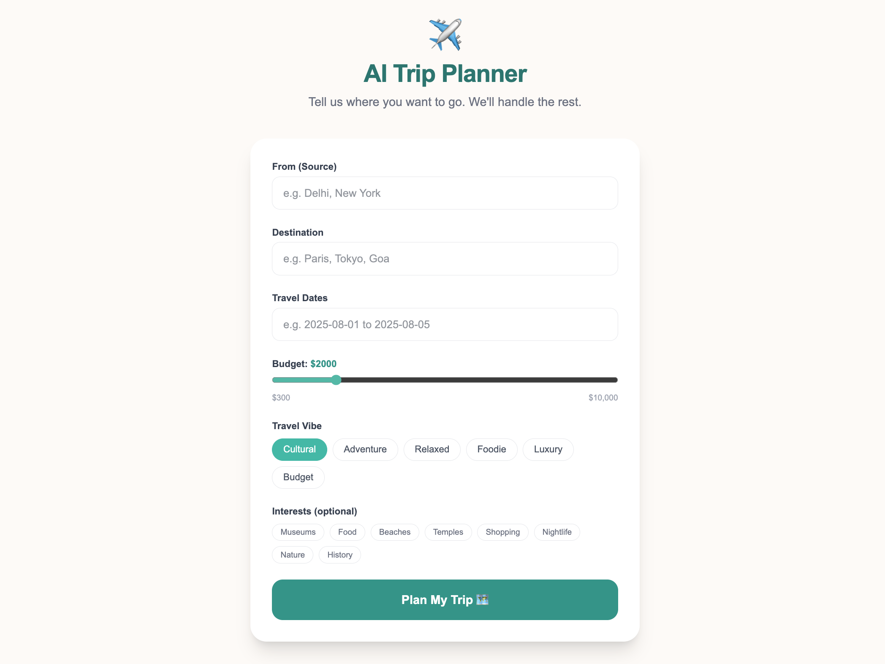
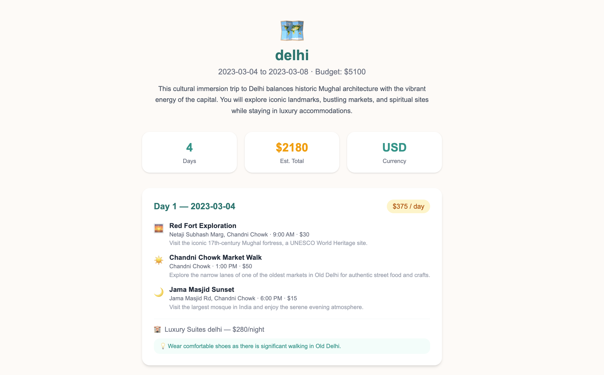
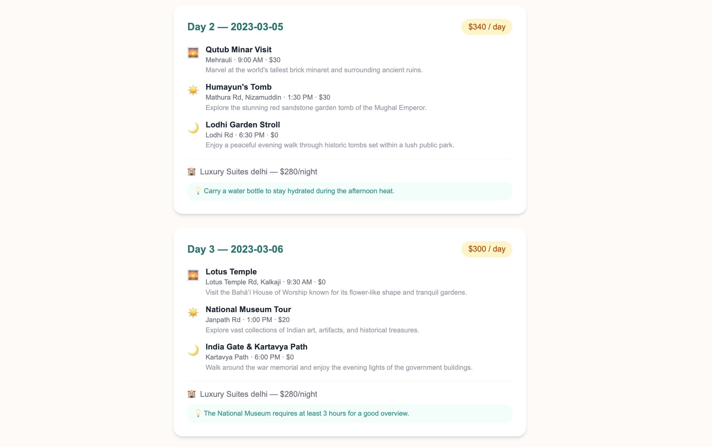
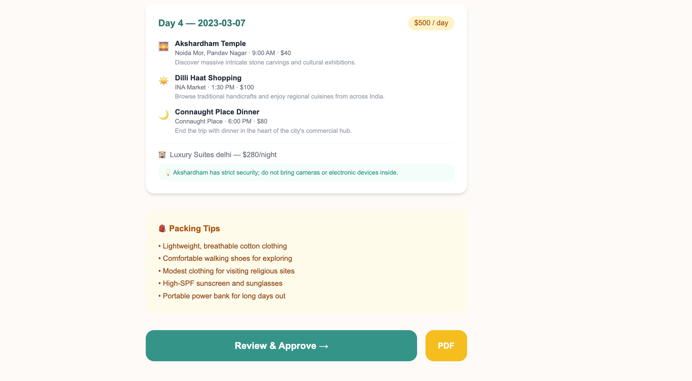
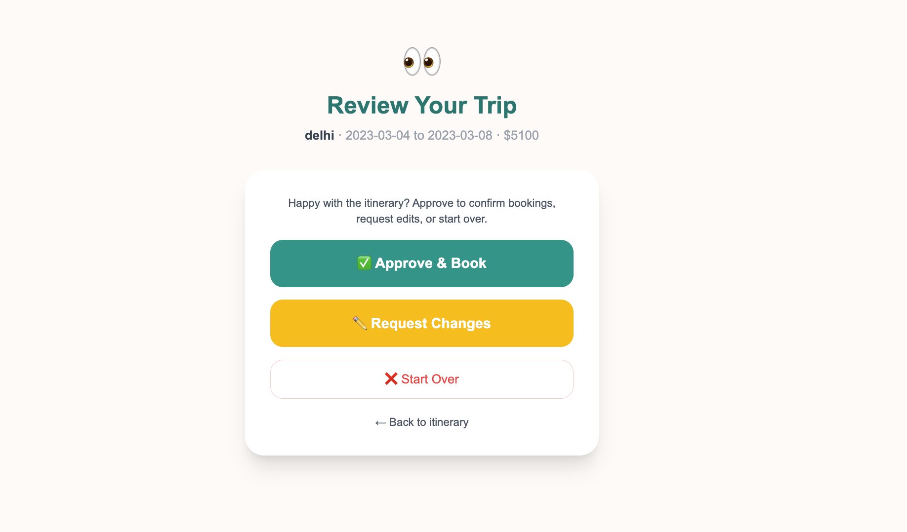
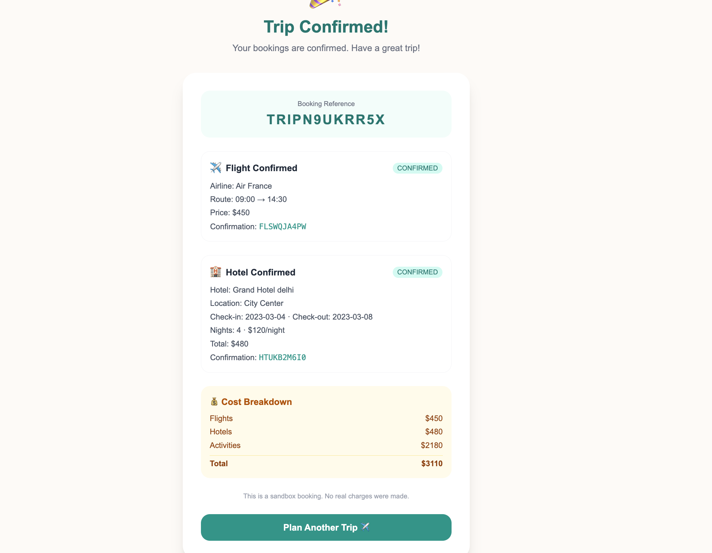
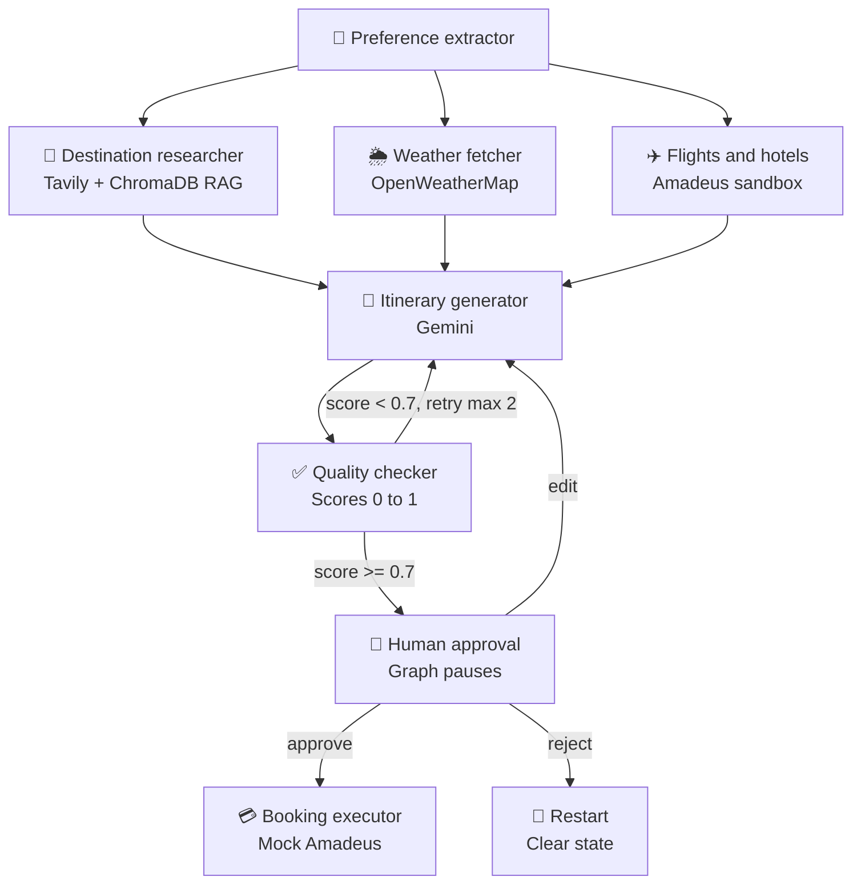

# 🌍✈️ AI Trip Planner Agent

### *An autonomous travel planning agent powered by LangGraph & Gemini*

---

## 🪄 Overview

This is an **agentic AI-powered trip planning system** — not a single LLM call, but a full multi-step agent graph with **parallel research, self-correction loops, human-in-the-loop checkpoints, and editable plans**.

Give it a source, destination, travel dates, budget, and vibe — the agent autonomously:

- 🔎 Researches the destination
- 🌦️ Checks the weather forecast
- ✈️ Finds flights & hotels
- 🧭 Generates a full day-by-day itinerary with Gemini
- ✅ Validates its own output for quality
- 🙋 Pauses for **human approval** before confirming bookings

---
## 📸 Screenshots

  
  

  
  

  
  

## ✨ How It Works

| Step | What Happens |
|------|--------------|
| 1️⃣ | User enters trip details — source, destination, dates, budget, travel vibe, interests |
| 2️⃣ | Agent **fans out** into parallel research: web search, weather forecast, flights & hotels |
| 3️⃣ | Gemini generates a structured **day-by-day itinerary** using all gathered context |
| 4️⃣ | A **quality checker** scores the itinerary on budget fit, routing logic, and feasibility |
| 5️⃣ | If the score is too low, the agent **automatically regenerates** with feedback (up to 2 retries) |
| 6️⃣ | The graph **pauses** and shows the itinerary for human review |
| 7️⃣ | User chooses: ✅ **Approve** (mock booking) · ✏️ **Edit** (regenerate with feedback) · ❌ **Reject** (restart) |

---

## 🔁 Agent Flow

---

## 🧠 Under the Hood

- 🗂️ **Shared state** — a `TripState` TypedDict flows through every node: source, destination, dates, budget, research results, weather, flights/hotels, itinerary, quality score, approval status, booking confirmation, and feedback.
- ⚡ **Parallel research** — LangGraph's `Send()` API runs destination research, weather, and flights/hotels concurrently, then merges results.
- 📚 **RAG** — destination research blends live Tavily web search with a local ChromaDB vector store seeded with city guides, embedded via sentence-transformers.
- 🔁 **Self-correction loop** — if the quality score falls below 0.7, the itinerary generator re-runs with feedback injected into its prompt, up to 2 retries.
- ⏸️ **Human-in-the-loop** — the graph compiles with `interrupt_before=["human_approval"]`, pausing and persisting state via `SqliteSaver` until the user responds.
- ✏️ **Edit loop** — user edit requests are stored as feedback, and the itinerary generator restructures the plan around the new request (e.g. adding a city, swapping activities).
- 💳 **Booking** — on approval, a mock Amadeus sandbox booking runs and returns confirmation codes — no real charges.

---

## 🛠️ Tech Stack

<table>
<tr>
<td valign="top" width="50%">

### 🤖 Agent & AI
- **LangGraph** — StateGraph, conditional edges, `Send()` parallel branches, `SqliteSaver` checkpointing, `interrupt_before`
- **Gemini** (`langchain-google-genai`) — itinerary generation & quality checking
- **Pydantic** — structured itinerary schema

### 🌐 APIs & Data
- **Tavily** — web search for destination research
- **OpenWeatherMap** — weather forecasting
- **Amadeus** (sandbox) — flight & hotel search + mock booking
- **ChromaDB + sentence-transformers** — local RAG vector store

</td>
<td valign="top" width="50%">

### ⚙️ Backend
- **FastAPI** — `/plan`, `/status`, `/approve`, `/edit`, `/reject`, `/export`
- **Server-Sent Events (SSE)** — live agent progress streaming
- **ReportLab** — PDF export of finalized itineraries
- **python-dotenv** — environment configuration

### 🎨 Frontend
- **Next.js** (App Router) + TypeScript
- **TailwindCSS** — warm travel theme, teal/blue primary, amber accents

</td>
</tr>
</table>

---

## 🎯 Highlights

> 🤖 **Fully agentic** — no manual orchestration, the graph decides what runs next based on state
> 🔁 **Self-correcting** — bad itineraries are caught and regenerated automatically
> 🙋 **Human-in-the-loop** — pauses for real user feedback before committing to bookings
> ✏️ **Editable plans** — natural language change requests reshape the itinerary, not just patch it
> 💸 **Zero cost** — built entirely on free-tier APIs

---

*Built with LangGraph 🦜🔗 · Powered by Gemini ✨*

